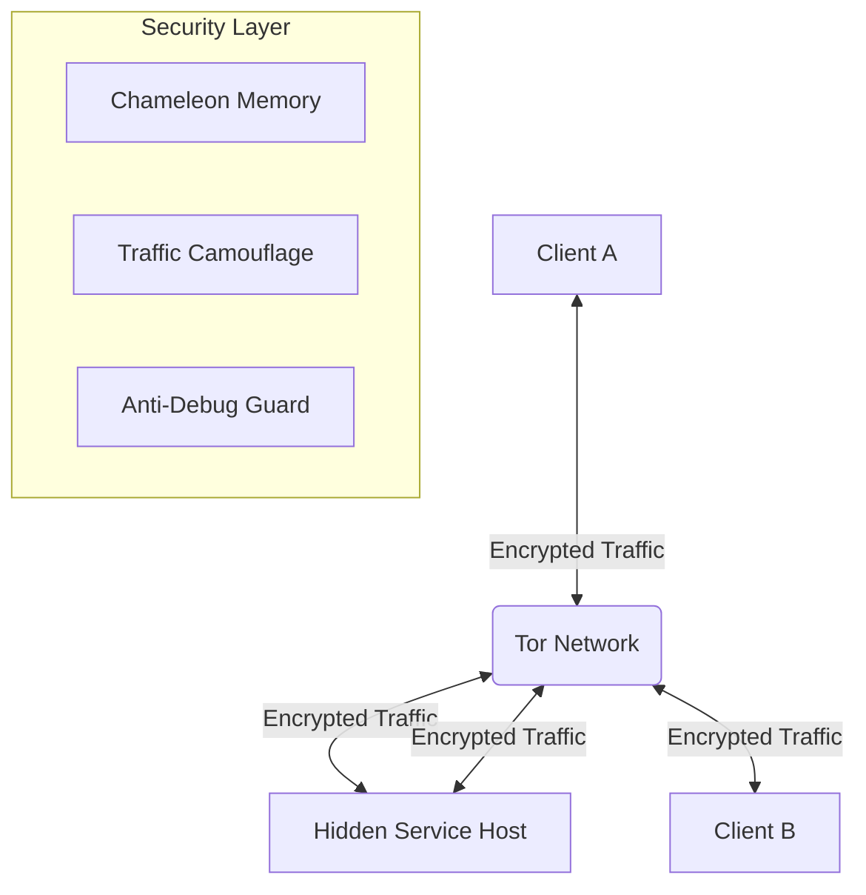

# 👻 Ghost-Link: Zero Trace Secure Communication

> **"Silence is the ultimate weapon."**

**Ghost-Link** is an advanced, cross-platform, anonymous chat system designed for **absolute privacy** and **zero digital footprint**. It utilizes **Tor Hidden Services** for network anonymity and a custom **Hybrid Double Encryption** protocol to ensure your communications remain unbreakable.

Built with **Anti-Forensics** and **Counter-Intelligence** features, Ghost-Link is not just a chat app; it's a digital ghost.

---

## 🚀 Key Features

### 🔐 Military-Grade Encryption (Matryoshka Protocol)
Your messages are encrypted twice before leaving your device:
1.  **Inner Layer:** ChaCha20-Poly1305 (High-speed, modern stream cipher).
2.  **Outer Layer:** AES-256-GCM (Industry standard block cipher).
3.  **Key Exchange:** X25519 Elliptic Curve Diffie-Hellman + HKDF SHA-256.

### 🧅 Tor Hidden Services (v3 Onion)
-   **No Port Forwarding:** Works behind firewalls, NATs, and CGNAT.
-   **End-to-End Anonymity:** Neither the server nor the client knows the other's IP address.
-   **Auto-Bootstrap:** Automatically downloads and configures the Tor Expert Bundle (v15.0.2).

### 🧠 Chameleon Memory™
-   **RAM Encryption:** Sensitive data (keys, messages) is **never** stored in plaintext in RAM.
-   **Dynamic Reshuffling:** Data in memory is constantly re-encrypted and moved to different addresses to defeat cold-boot attacks and memory dumps.
-   **Secure Wipe:** Uses `ctypes` to overwrite memory with zeros immediately after use.

### 🎭 Traffic Camouflage (Polymorphic Protocol)
-   **Deep Packet Inspection (DPI) Evasion:** Chat traffic is disguised as normal HTTP requests to legitimate services.
-   **Decoy Headers:** Mimics traffic to:
    -   Microsoft Telemetry
    -   Google Analytics
    -   Facebook Graph API
    -   AWS S3 Uploads
-   **Noise Generator:** Randomly injects fake "decoy" packets to confuse traffic analysis.

### 🛡️ Active Defense Systems
-   **Anti-Debug:** Detects debuggers (x64dbg, OllyDbg, GDB) and triggers fake error loops.
-   **Anti-VM/Sandbox:** Checks for virtualization artifacts.
-   **Panic Mode (`/nuke`):** A single command securely deletes the entire application, wipes memory, and shuts down the system.

---

## 📦 Installation

### Prerequisites
-   **Python 3.8+**
-   **Internet Connection** (for initial Tor download)

### Setup
1.  Clone the repository:
    ```bash
    git clone https://github.com/Muhammedpyz/Ghost-Link-Zero-Trace-Secure-Communication.git
    cd Ghost-Link
    ```

2.  Run the starter script:
    ```bash
    python start.py
    ```
    *The script will automatically install required dependencies (`stem`, `cryptography`, `psutil`, etc.) and setup the environment.*

---

## 🎮 Usage

### 1. Host a Room (Server)
Select **Option 1** in the menu.
-   The system will start a Tor Hidden Service.
-   It will generate a unique **.onion address** (e.g., `v2c...xyz.onion`).
-   Share this address with your peer securely.
-   The server automatically opens a client window for you.

### 2. Join a Room (Client)
Select **Option 2** in the menu.
-   Enter the **.onion address** provided by the host.
-   Wait for the Tor connection to establish.
-   Once connected, the secure handshake will complete, and you can chat.

### 3. Commands
-   `/clear` : Wipes the terminal screen and history.
-   `/nuke` : **DANGER!** Securely deletes the application files, wipes RAM, and exits. Use only in emergencies.

---

## ⚠️ Disclaimer
This tool is designed for **educational purposes** and **privacy research**. The developers are not responsible for any misuse of this software. Use it responsibly and in accordance with your local laws.

---

## 🏗️ Architecture



---

**Ghost-Link** - *See everything, leave nothing.*
